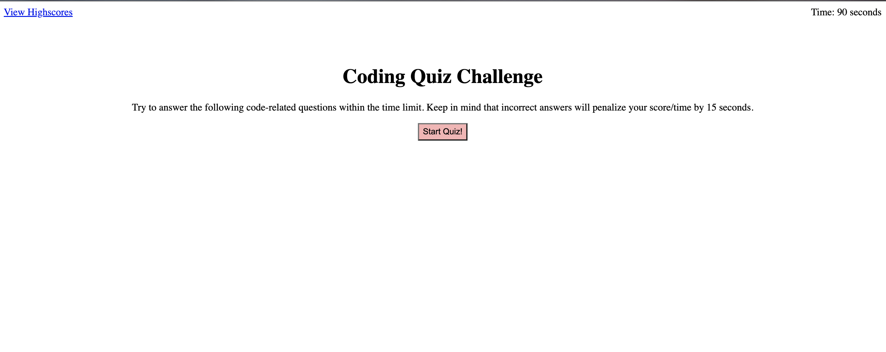

# Challenge 4: Timed Coding Quiz

## Description
This week's challenge was to build a timed coding quiz with multiple-choice questions.

The acceptance criteria is as follows:
GIVEN I am taking a code quiz
WHEN I click the start button
THEN a timer starts and I am presented with a question
WHEN I answer a question
THEN I am presented with another question
WHEN I answer a question incorrectly
THEN time is subtracted from the clock
WHEN all questions are answered or the timer reaches 0
THEN the game is over
WHEN the game is over
THEN I can save my initials and my score

To complete this project, I put into practice my knowledge of advanced JavaScript and Web API's.

## Installation

N/A

## Usage

[Here is the link to the timed coding quiz application.](https://mariea1022.github.io/timed-coding-quiz/)

To start the quiz, click the "Start Quiz!" button. You will then be presented with a series of questions. To submit an answer, you will need to click on one of the choices. When all the questions have been answered or the timer reaches 0, you will then need to submit your initials to save your score.

Below is the image of the timed coding quiz application.

## Credits

N/A

## License

Please refer to the LICENSE in the repo.
